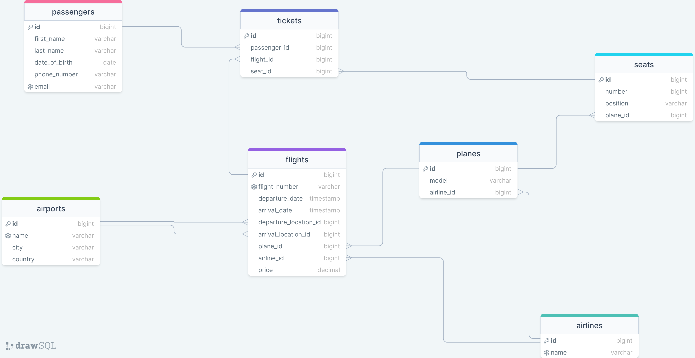

# Air Nex Control System

## Temat projektu: *System obsługi lotniska*

## Schemat bazy danych

## Podział prac

### Maciej Deroń
- Utworzenie projektu
- Zaprojektowanie bazy danych
- Implementacja encji + testy
- Implementacja value objects + testy
- Implementacja converterów
- Implementacja exception handlerów
- Implementacja Plane(Repository, Service, Controller) + potrzebne DTO, Komendy, plik Http, wyjątki
- Implementacja Flight(Repository, Service, Controller) + potrzebne DTO, Komendy, plik Http, wyjątki

### Paweł Dostal
- Implementacja Airport(Repository, Service, Controller) + potrzebne DTO, Komendy, plik Http, wyjątki
- Współimplementacja Ticket(Repository, Service, Controller) + potrzebne DTO, Komendy, plik Http, wyjątki

## Mariusz Ignaciuk
- Implementacja Airline(Repository, Service, Controller) + potrzebne DTO, Komendy, plik Http, wyjątki
- Współimplementacja Ticket(Repository, Service, Controller) + potrzebne DTO, Komendy, plik Http, wyjątki

### Julia Dziekańska
- Implementacja Passenger(Repository, Service, Controller) + potrzebne DTO, Komendy, plik Http, wyjątki
- Współimplementacja Ticket(Repository, Service, Controller) + potrzebne DTO, Komendy, plik Http, wyjątki

## Autorzy
- Maciej Deroń
- Paweł Dostal
- Mariusz Ignaciuk
- Julia Dziekańska
